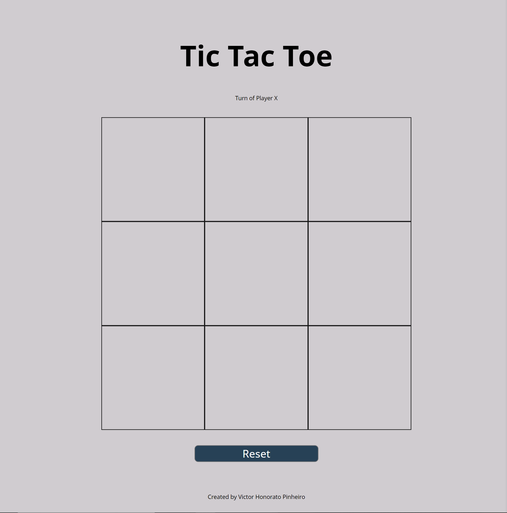
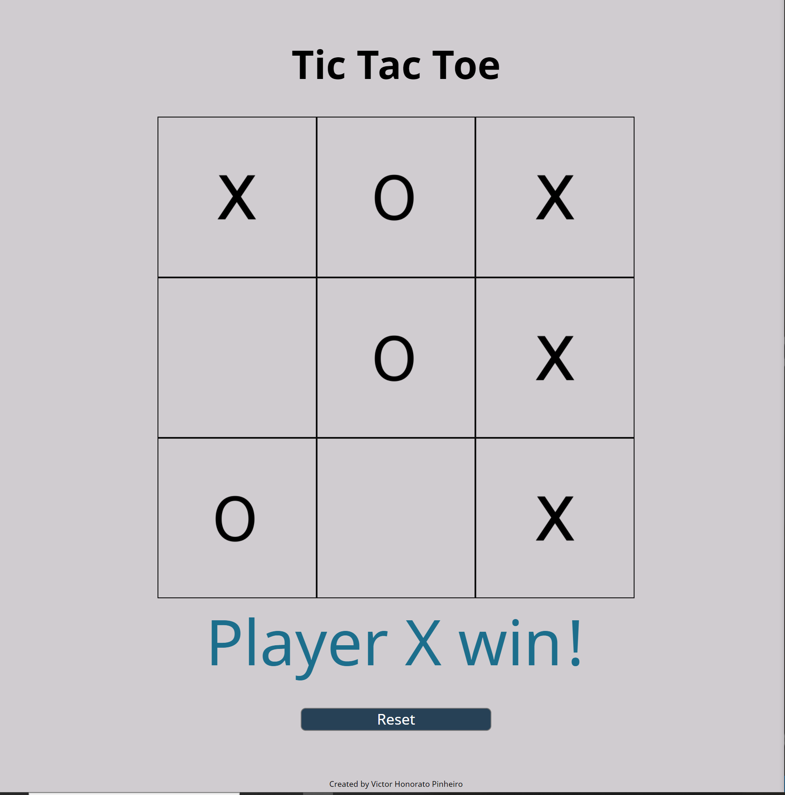
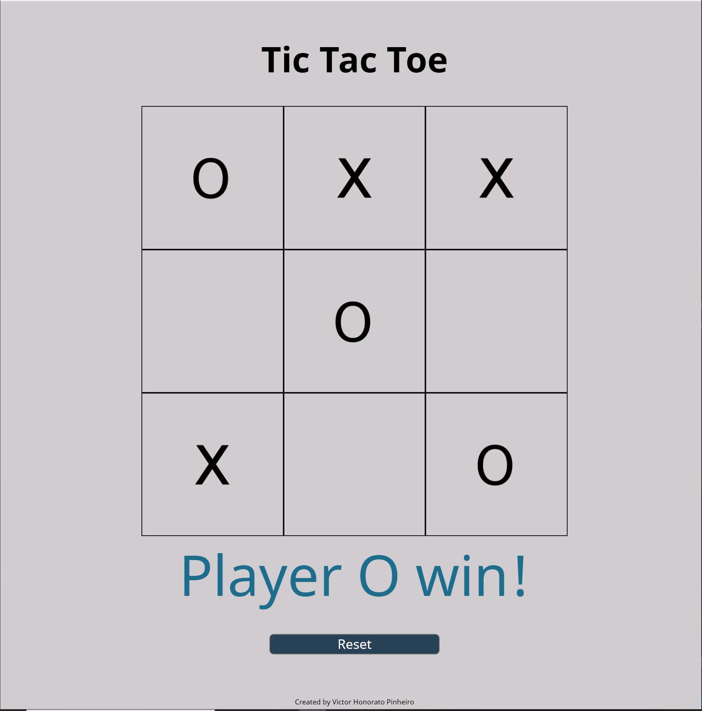
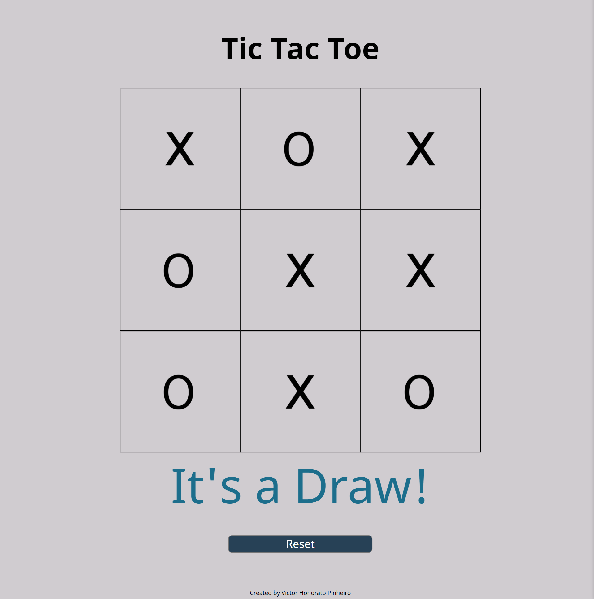

# Version 1.0 tic-tac-toe game

This was my first attempt to create an application only front-end with CSS-HTML-Pure Javascript

The logic is solid and the game run without any mistakes! check it out.

# Screenshots

Clean board

X wins

O wins

Draws

# Things to improve

- Game not totatlly responsive in the height direction
- The logic to check the winner can be improved, not the best design
